# イベント処理とサブスクリプションフロー

このドキュメントでは、サブスクリプション、ノードチェーン、イベント発行、ユーザー編集がいつ・どのように処理されるかを説明します。

## 概要

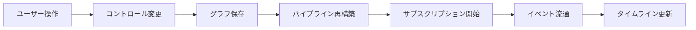

## 1. パイプライン再構築プロセス

### 前提: グラフ構造とObservable接続

- **グラフ構造（Edge/Connection）**: rete.jsエディタ上の接続線。ユーザーが編集済みで既に存在する。
- **Observable接続（setInput）**: RxJSのsubscribe。rebuildPipeline()で設定する。

ステップ2の「探索」は既存のグラフ構造を参照し、ステップ4-12でObservableを設定します。

### 実行順序

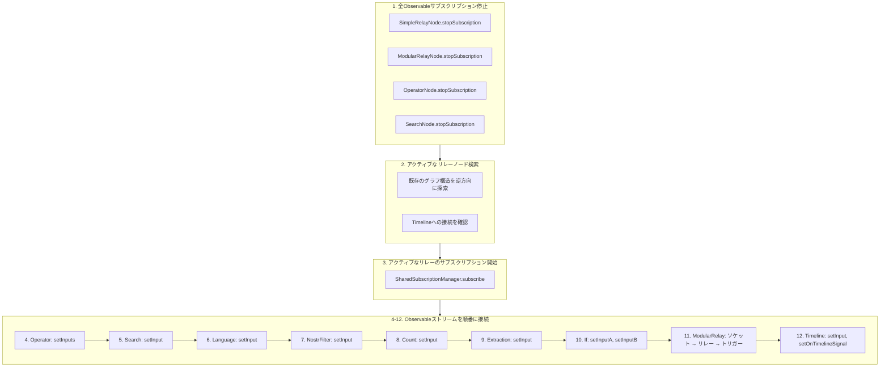

### ノード入力接続パターン

各処理ノードは以下のパターンに従います：

```typescript
setInput(input$: Observable<Signal> | null): void {
  this.input$ = input$;
  this.rebuildPipeline();
}

private rebuildPipeline(): void {
  // 1. 既存のサブスクリプションを停止
  this.stopSubscription();

  // 2. 入力がなければ早期リターン
  if (!this.input$) return;

  // 3. 処理を含む新しいサブスクリプションを作成
  this.subscription = this.input$.pipe(
    filter(...),  // またはその他のオペレータ
  ).subscribe({
    next: (signal) => this.outputSubject.next(transformedSignal)
  });
}
```

## 2. サブスクリプションのライフサイクル

### 状態マシン: リレーサブスクリプション

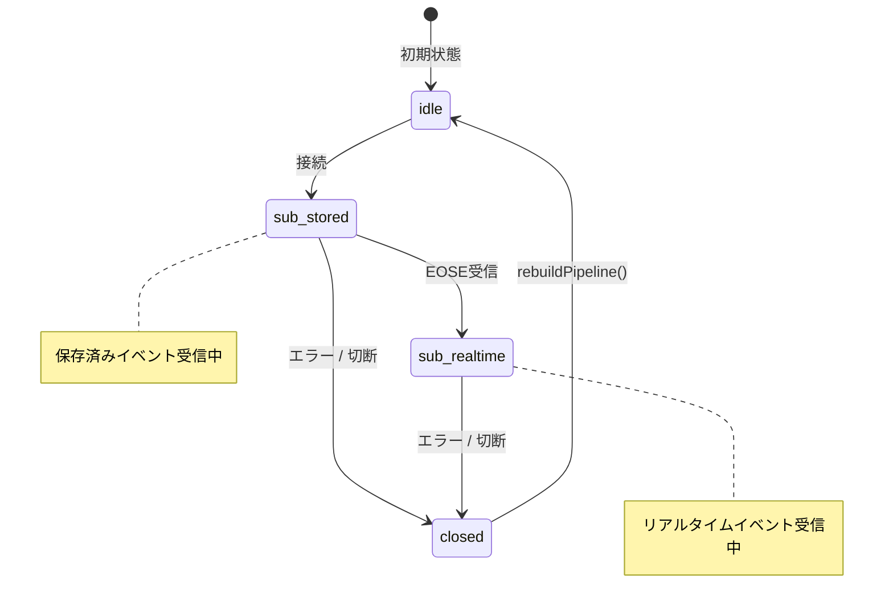

### サブスクリプション開始タイミング

| トリガー | 場所 | 説明 |
|---------|------|------|
| アプリ起動 | `GraphEditor.tsx` `useEffect` | localStorage/Nostrからグラフ読込後、`rebuildPipeline()` |
| 接続追加 | `GraphEditor.tsx` `handleConnectionCreated` | グラフ保存後、`rebuildPipeline()` |
| 接続削除 | `GraphEditor.tsx` `handleConnectionRemoved` | グラフ保存後、`rebuildPipeline()` |
| コントロール変更 | `GraphEditor.tsx` `handleControlChange` | グラフ保存、下流タイムラインクリア後、`rebuildPipeline()` |
| ModularRelayトリガー | `ModularRelayNode.ts` `tryStartSubscription` | トリガー入力がtrueになった時 |

### サブスクリプション停止タイミング

| トリガー | 場所 | 説明 |
|---------|------|------|
| 再構築前 | `rebuildPipeline()` | 全ノードの`stopSubscription()`を最初に呼出 |
| ノード削除 | `handleDelete()` | ノード削除により再構築発生 |
| 接続削除 | `handleConnectionRemoved()` | リレーが非アクティブになる場合 |
| ModularRelayトリガー=false | `ModularRelayNode.ts` | トリガーがfalseになった時に停止 |

## 3. イベント発行フロー

### シグナル型

| ソケット型 | シグナル形式 | 発生元 |
|-----------|-------------|--------|
| Event | `{ event: NostrEvent, signal: 'add' \| 'remove' }` | SimpleRelayNode, ModularRelayNode |
| EventId | `{ eventId: string, signal: 'add' \| 'remove' }` | ExtractionNode |
| Pubkey | `{ pubkey: string, signal: 'add' \| 'remove' }` | ExtractionNode, Nip07Node |
| Relay | `{ relay: string, signal: 'add' \| 'remove' }` | ExtractionNode, ConstantNode |
| Integer | `{ type: 'integer', value: number }` | CountNode, ConstantNode |
| Datetime | `{ type: 'datetime', value: number }` | ExtractionNode, ConstantNode |
| Flag | `{ flag: boolean }` | IfNode, ConstantNode |
| RelayStatus | `{ relay: string, status: RelayStatusType }` | ModularRelayNode |
| Trigger | `{ trigger: boolean }` | ConstantNode, IfNode |

### イベントフロー例

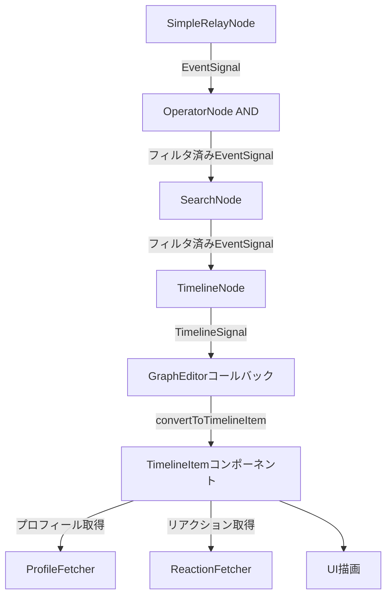

### Operatorノードの処理

| オペレータ | 動作 |
|-----------|------|
| OR | `merge(input1$, input2$)` - 両方のストリームをそのまま通過 |
| AND | イベントIDが両方の入力で確認された場合のみ発行 |
| A-B | input1はそのまま通過、input2のシグナルを反転（add↔remove） |

### Extractionノードの処理

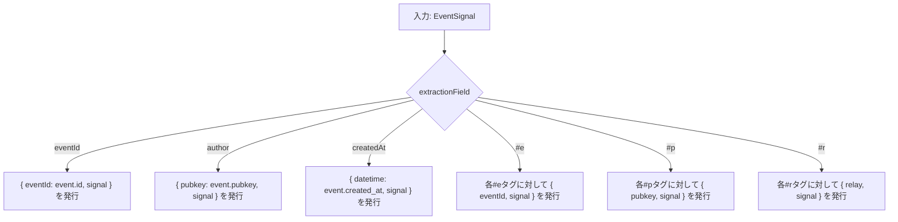

## 4. ユーザー編集トリガー

### 状態マシン: コントロール変更

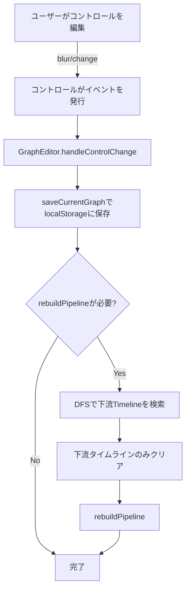

### コントロール型と再構築動作

| コントロール型 | 再構築を発火 | 例 |
|---------------|-------------|-----|
| TextInputControl | Yes（デフォルト） | リレーURL、検索キーワード |
| TextInputControl | No（フラグ設定時） | タイムライン名 |
| SelectControl | Yes | オペレータ型、抽出フィールド |
| CheckboxControl | Yes | 除外チェックボックス |
| FilterControl | Yes | リレーフィルタ |

### 下流タイムライン検出

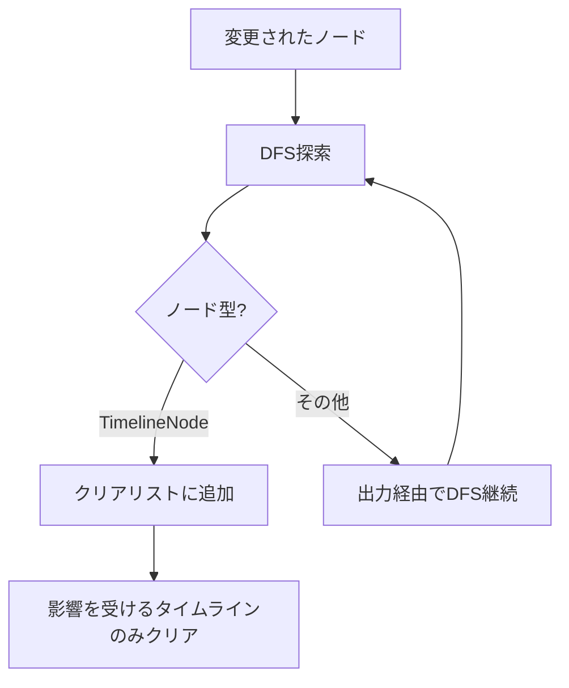

## 5. SharedSubscriptionManager

### 目的

複数のSimpleRelayNodeが1つのリレーに対して1つのWebSocket接続を共有できます。

### 状態マシン: リレー接続

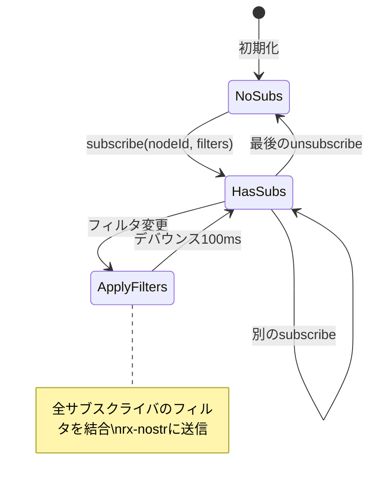

### フィルタ結合

```typescript
// 異なるフィルタを持つ複数のサブスクライバ
サブスクライバA: { kinds: [1], authors: [alice] }
サブスクライバB: { kinds: [1], authors: [bob] }

// リレーに送信される結合フィルタ
結合: { kinds: [1], authors: [alice, bob] }

// イベントルーティング
aliceからのイベント → サブスクライバAのみにブロードキャスト
bobからのイベント   → サブスクライバBのみにブロードキャスト
```

## 6. ModularRelayNodeの起動シーケンス

### 状態マシン: ModularRelayサブスクリプション

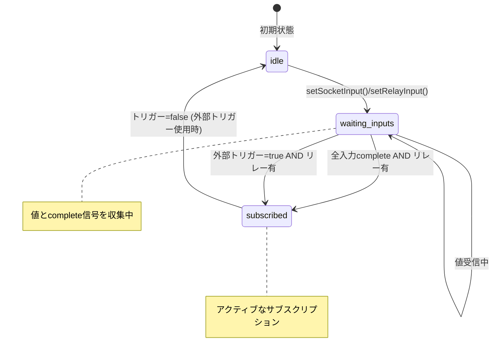

### tryStartSubscription()の条件

サブスクリプション開始条件：
```
(triggerState OR areAllSocketsCompleted()) AND relayUrls.length > 0 AND areRequiredInputsConnected() AND !isSubscribed()
```

条件の詳細：
| 条件 | 説明 |
|------|------|
| `triggerState` | 外部トリガーがtrue（または未接続時はデフォルトtrue） |
| `areAllSocketsCompleted()` | 全ソケット入力がcomplete信号を受信済み |
| `relayUrls.length > 0` | リレーURLを1つ以上受信済み |
| `areRequiredInputsConnected()` | 必要な全ソケットが接続済み |
| `!isSubscribed()` | まだサブスクライブしていない |

**動作:**
- 外部トリガーを使用する場合：トリガーがtrueになったら即座にサブスクリプション開始（ソケット完了を待たない）
- 外部トリガーを使用しない場合：全ソケット入力がcompleteしたらサブスクリプション開始

### RxJS complete信号の伝播

ConstantNodeとNip07Nodeは値を発行後、`complete()`を呼び出します。これにより下流ノードはすべての初期値が送信されたことを知ることができます。

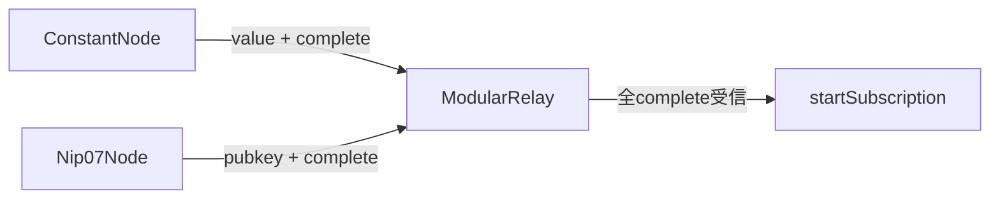

中間ノード（IfNode、ExtractionNode等）は、全入力がcompleteした時に出力をcompleteします。

## 7. タイムラインアイテム処理

### 状態マシン: タイムラインアイテム

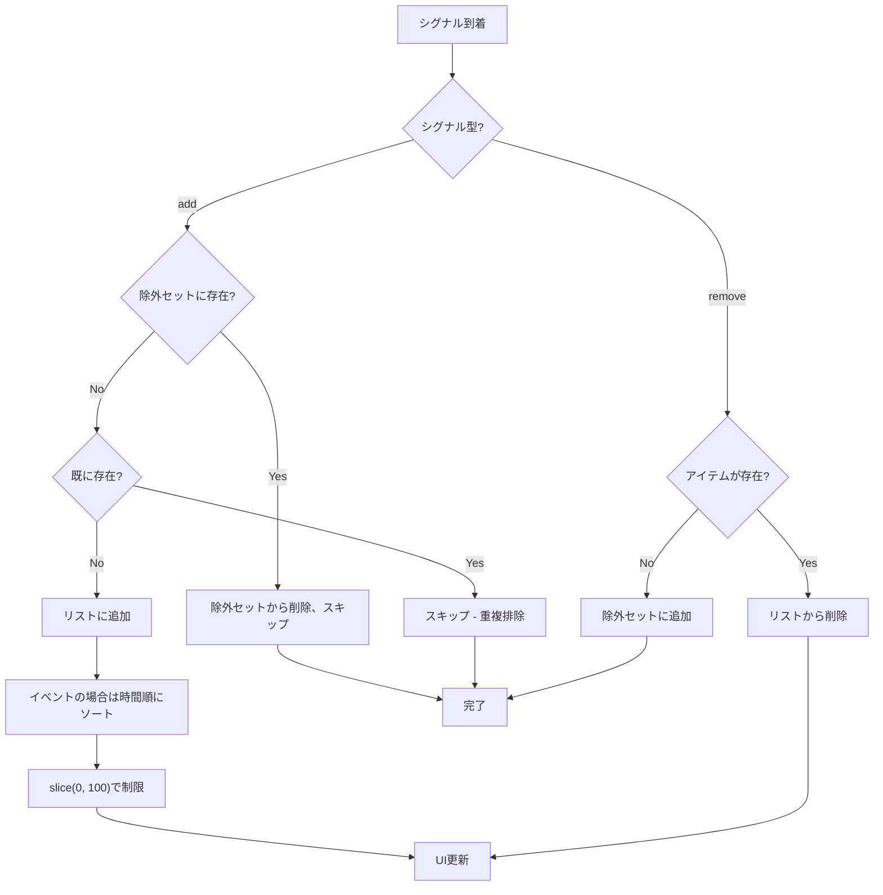

## 8. バックグラウンドフェッチャー

### ProfileFetcher

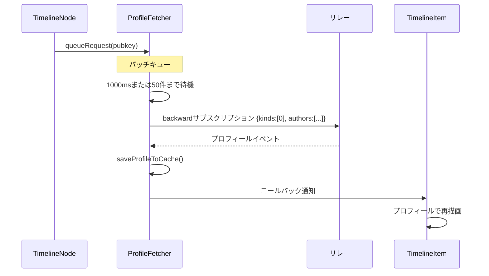

### ReactionFetcher

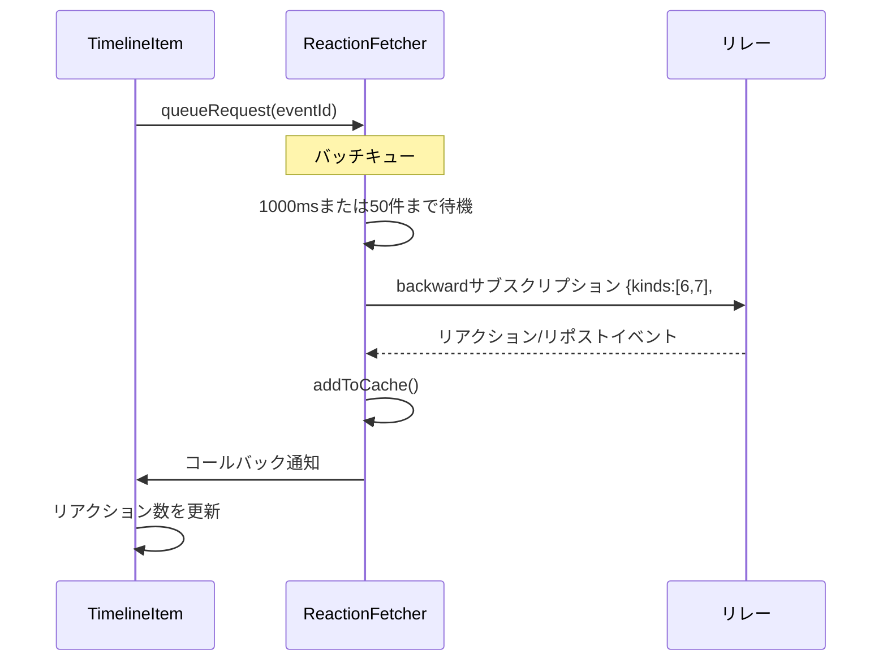

## ソースファイル

| コンポーネント | ファイル | 主要関数 |
|--------------|---------|----------|
| GraphEditor | `src/components/Graph/GraphEditor.tsx` | `rebuildPipeline()`, `handleControlChange()` |
| SimpleRelayNode | `src/components/Graph/nodes/SimpleRelayNode.ts` | `startSubscription()`, `stopSubscription()` |
| ModularRelayNode | `src/components/Graph/nodes/ModularRelayNode.ts` | `tryStartSubscription()`, `setTriggerInput()` |
| OperatorNode | `src/components/Graph/nodes/OperatorNode.ts` | `setInputs()`, `rebuildPipeline()` |
| SearchNode | `src/components/Graph/nodes/SearchNode.ts` | `setInput()`, `rebuildPipeline()` |
| TimelineNode | `src/components/Graph/nodes/TimelineNode.ts` | `setInput()`, `setOnTimelineSignal()` |
| ExtractionNode | `src/components/Graph/nodes/ExtractionNode.ts` | `setInput()`, `extractAndEmit()` |
| SharedSubscriptionManager | `src/nostr/SharedSubscriptionManager.ts` | `subscribe()`, `applyFilters()` |
| ProfileFetcher | `src/nostr/ProfileFetcher.ts` | `queueRequest()`, `flushBatch()` |
| ReactionFetcher | `src/nostr/ReactionFetcher.ts` | `queueRequest()`, `flushBatch()` |
