# Event Processing and Subscription Flow

This document describes when and how subscriptions, node chains, event emissions, and user editing are processed.

## Overview

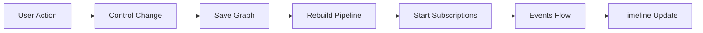

## 1. Pipeline Rebuild Process

### Prerequisite: Graph Structure vs Observable Wiring

- **Graph Structure (Edge/Connection)**: Connection lines in rete.js editor. Already exists from user editing.
- **Observable Wiring (setInput)**: RxJS subscribe. Set up during rebuildPipeline().

Step 2 "traversal" refers to the existing graph structure, and steps 4-12 set up the Observables.

### Execution Order

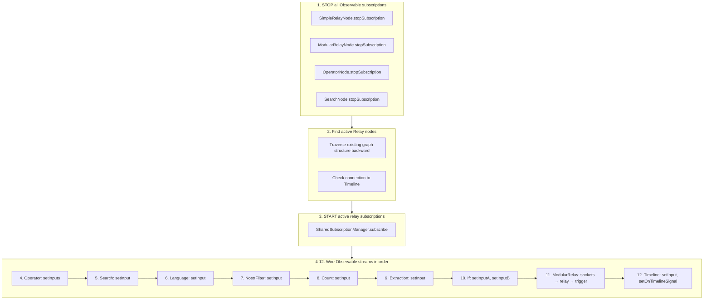

### Node Input Wiring Pattern

Each processing node follows this pattern:

```typescript
setInput(input$: Observable<Signal> | null): void {
  this.input$ = input$;
  this.rebuildPipeline();
}

private rebuildPipeline(): void {
  // 1. Stop existing subscription
  this.stopSubscription();

  // 2. Early return if no input
  if (!this.input$) return;

  // 3. Create new subscription with processing
  this.subscription = this.input$.pipe(
    filter(...),  // or other operators
  ).subscribe({
    next: (signal) => this.outputSubject.next(transformedSignal)
  });
}
```

## 2. Subscription Lifecycle

### State Machine: Relay Subscription

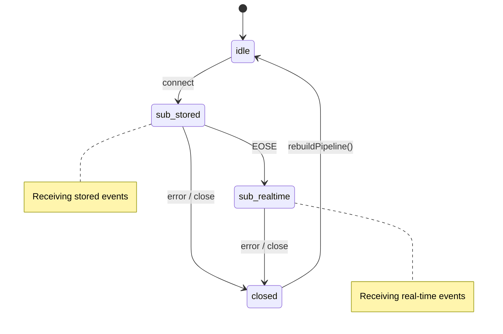

### When Subscriptions Start

| Trigger | Location | Description |
|---------|----------|-------------|
| App load | `GraphEditor.tsx` `useEffect` | Load graph from localStorage/Nostr, then `rebuildPipeline()` |
| Add connection | `GraphEditor.tsx` `handleConnectionCreated` | Save graph, then `rebuildPipeline()` |
| Remove connection | `GraphEditor.tsx` `handleConnectionRemoved` | Save graph, then `rebuildPipeline()` |
| Control change | `GraphEditor.tsx` `handleControlChange` | Save graph, clear downstream timelines, then `rebuildPipeline()` |
| ModularRelay trigger | `ModularRelayNode.ts` `tryStartSubscription` | When trigger input becomes true |

### When Subscriptions Stop

| Trigger | Location | Description |
|---------|----------|-------------|
| Before rebuild | `rebuildPipeline()` | All nodes' `stopSubscription()` called first |
| Node deleted | `handleDelete()` | Node removed, triggers rebuild |
| Connection removed | `handleConnectionRemoved()` | Relay may become inactive |
| ModularRelay trigger=false | `ModularRelayNode.ts` | Stop when trigger becomes false |

## 3. Event Emission Flow

### Signal Types

| Socket Type | Signal Format | Source |
|-------------|---------------|--------|
| Event | `{ event: NostrEvent, signal: 'add' \| 'remove' }` | SimpleRelayNode, ModularRelayNode |
| EventId | `{ eventId: string, signal: 'add' \| 'remove' }` | ExtractionNode |
| Pubkey | `{ pubkey: string, signal: 'add' \| 'remove' }` | ExtractionNode, Nip07Node |
| Relay | `{ relay: string, signal: 'add' \| 'remove' }` | ExtractionNode, ConstantNode |
| Integer | `{ type: 'integer', value: number }` | CountNode, ConstantNode |
| Datetime | `{ type: 'datetime', value: number }` | ExtractionNode, ConstantNode |
| Flag | `{ flag: boolean }` | IfNode, ConstantNode |
| RelayStatus | `{ relay: string, status: RelayStatusType }` | ModularRelayNode |
| Trigger | `{ trigger: boolean }` | ConstantNode, IfNode |

### Event Flow Example

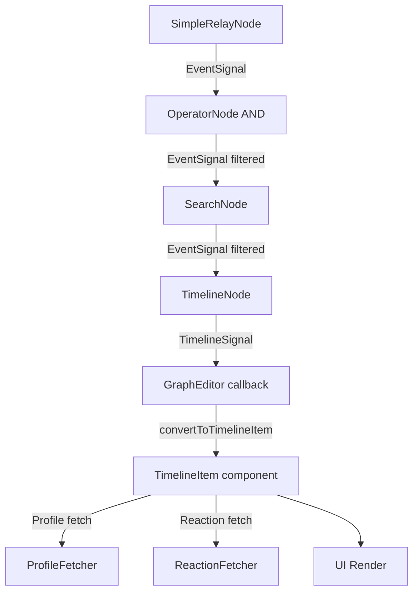

### Operator Node Processing

| Operator | Behavior |
|----------|----------|
| OR | `merge(input1$, input2$)` - pass through both streams |
| AND | Emit only when event ID seen from both inputs |
| A-B | Pass input1 as-is; invert input2 signals (add↔remove) |

### Extraction Node Processing

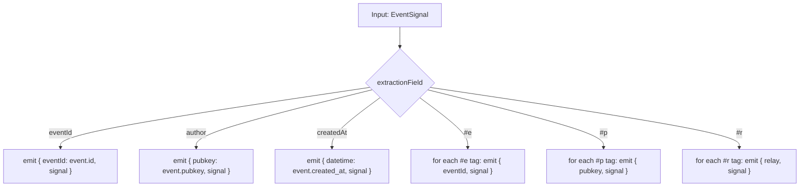

## 4. User Editing Triggers

### State Machine: Control Change

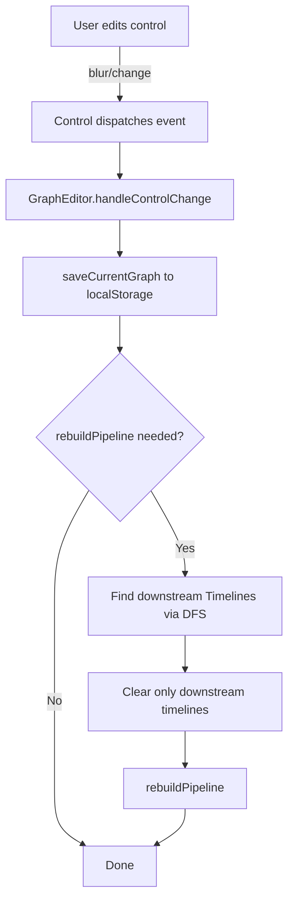

### Control Types and Rebuild Behavior

| Control Type | Triggers Rebuild | Example |
|--------------|------------------|---------|
| TextInputControl | Yes (default) | Relay URL, Search keyword |
| TextInputControl | No (if flag set) | Timeline name |
| SelectControl | Yes | Operator type, Extraction field |
| CheckboxControl | Yes | Exclude checkbox |
| FilterControl | Yes | Relay filters |

### Downstream Timeline Detection

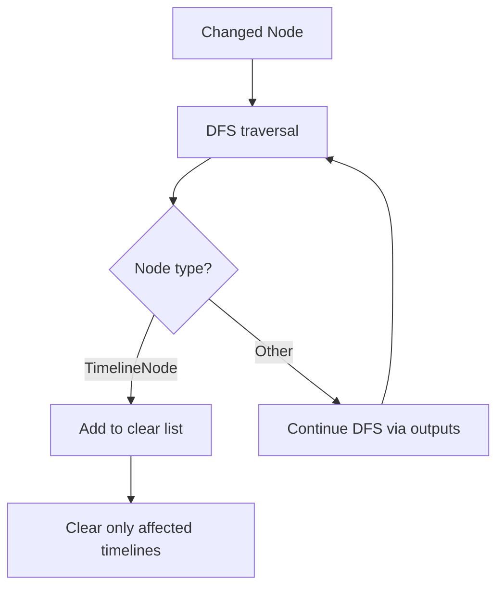

## 5. SharedSubscriptionManager

### Purpose

Multiple SimpleRelayNodes can share one WebSocket connection per relay.

### State Machine: Relay Connection

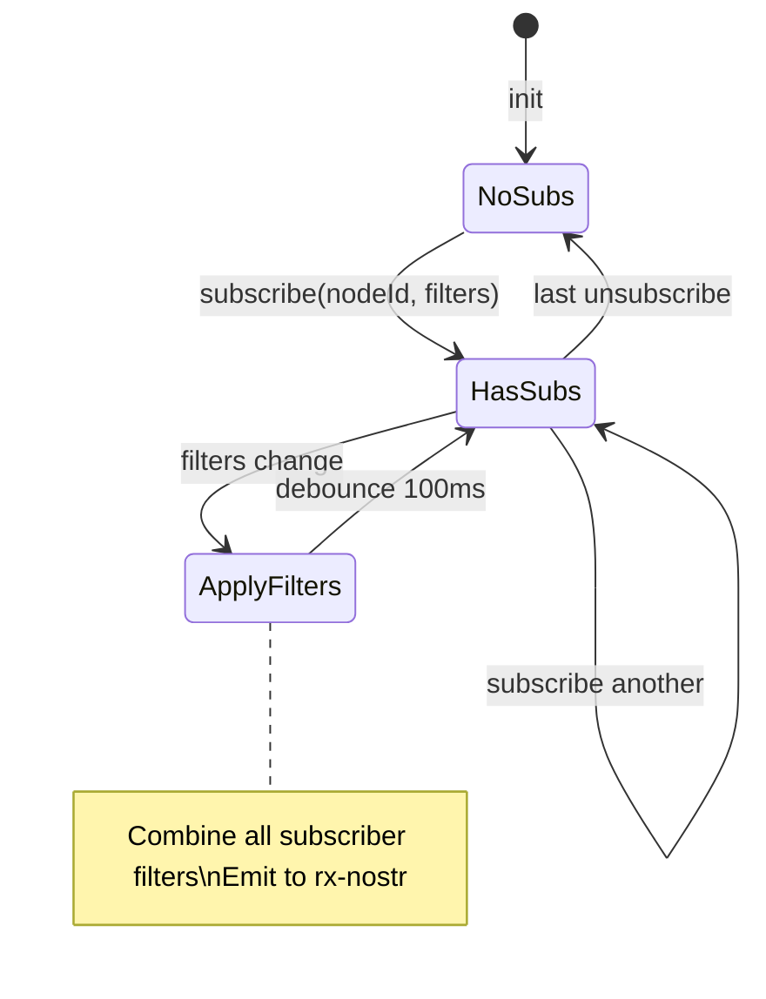

### Filter Combination

```typescript
// Multiple subscribers with different filters
Subscriber A: { kinds: [1], authors: [alice] }
Subscriber B: { kinds: [1], authors: [bob] }

// Combined filter sent to relay
Combined: { kinds: [1], authors: [alice, bob] }

// Event routing
Event from alice → broadcast to Subscriber A only
Event from bob   → broadcast to Subscriber B only
```

## 6. ModularRelayNode Startup Sequence

### State Machine: ModularRelay Subscription

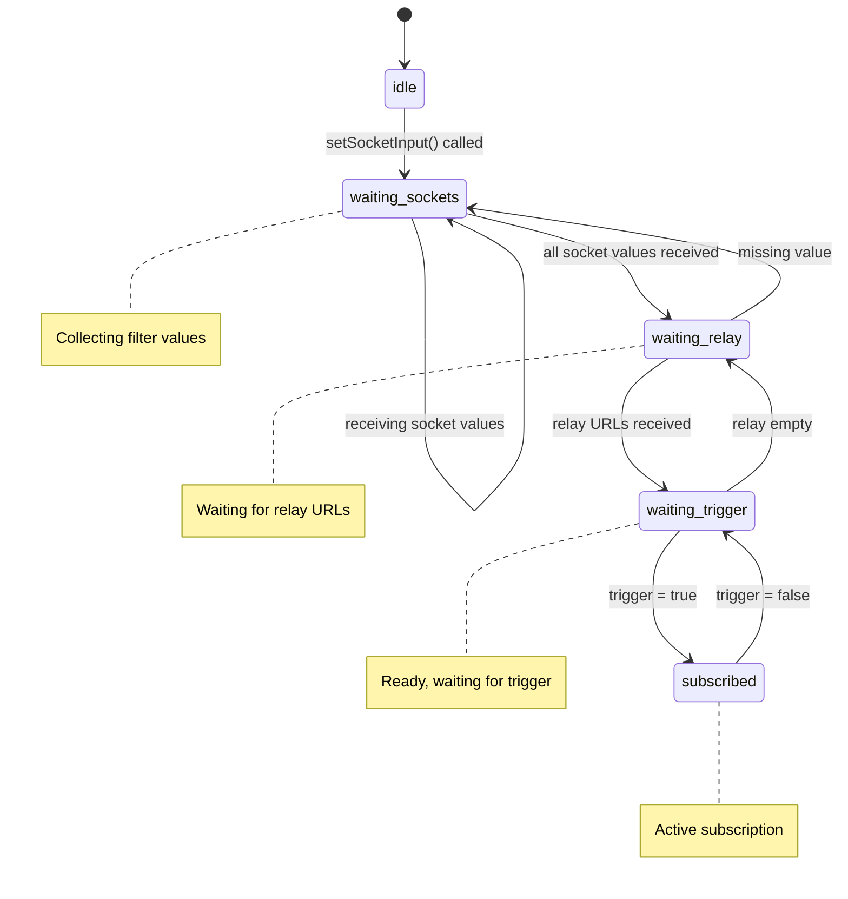

### tryStartSubscription() Conditions

All conditions must be true:
1. `triggerState === true` (or no trigger input connected)
2. `relayUrls.length > 0`
3. `areRequiredInputsConnected()` - all required sockets wired
4. `areAllSocketValuesReceived()` - all socket values received
5. `!isSubscribed()` - not already subscribed

## 7. Timeline Item Processing

### State Machine: Timeline Item

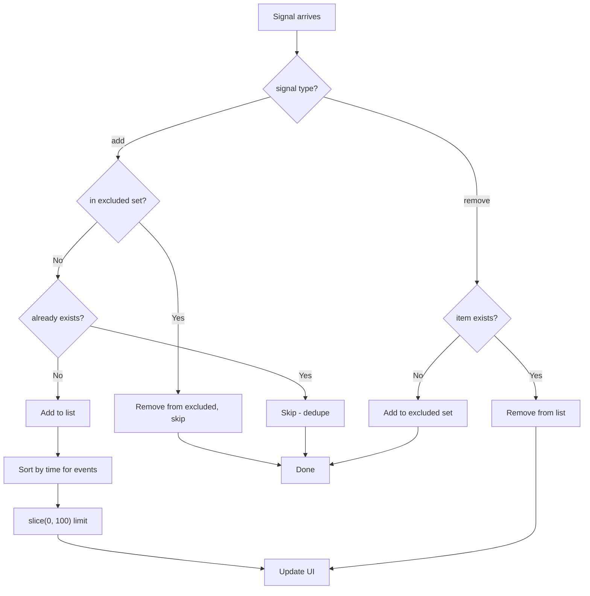

## 8. Background Fetchers

### ProfileFetcher

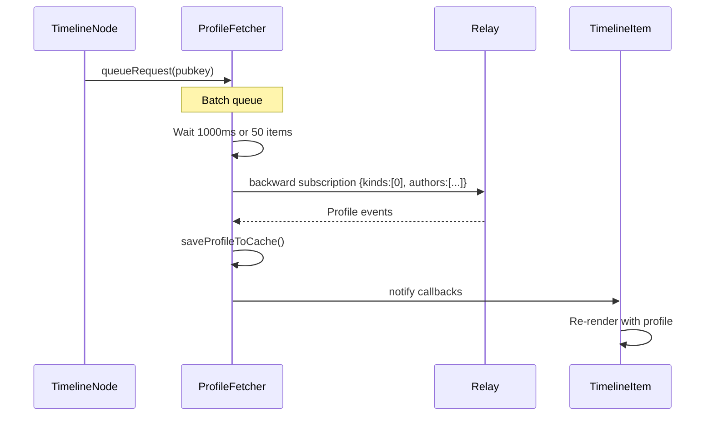

### ReactionFetcher

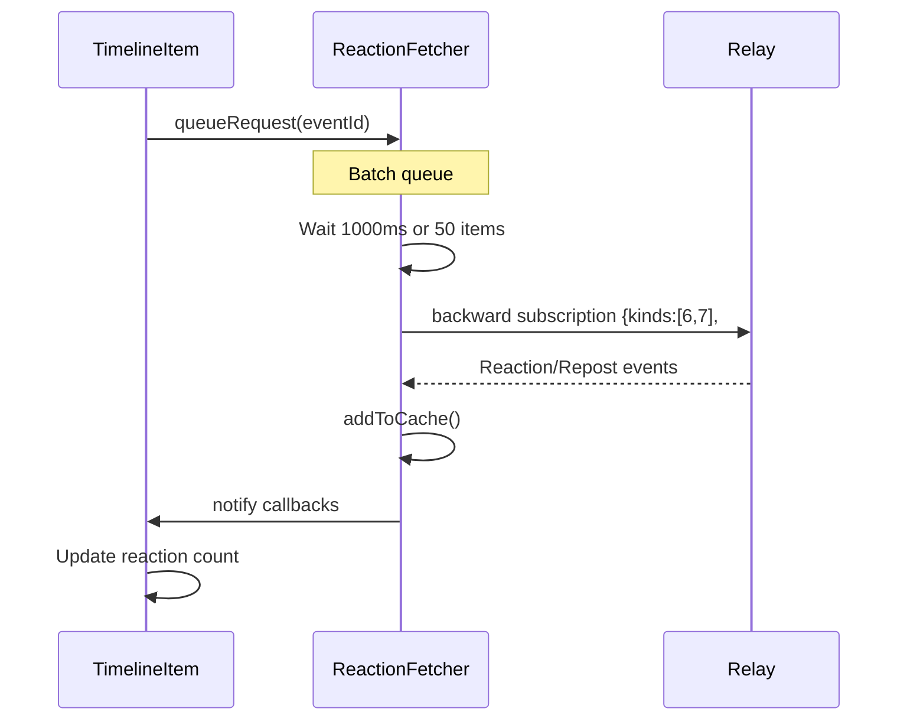

## Source Files

| Component | File | Key Functions |
|-----------|------|---------------|
| GraphEditor | `src/components/Graph/GraphEditor.tsx` | `rebuildPipeline()`, `handleControlChange()` |
| SimpleRelayNode | `src/components/Graph/nodes/SimpleRelayNode.ts` | `startSubscription()`, `stopSubscription()` |
| ModularRelayNode | `src/components/Graph/nodes/ModularRelayNode.ts` | `tryStartSubscription()`, `setTriggerInput()` |
| OperatorNode | `src/components/Graph/nodes/OperatorNode.ts` | `setInputs()`, `rebuildPipeline()` |
| SearchNode | `src/components/Graph/nodes/SearchNode.ts` | `setInput()`, `rebuildPipeline()` |
| TimelineNode | `src/components/Graph/nodes/TimelineNode.ts` | `setInput()`, `setOnTimelineSignal()` |
| ExtractionNode | `src/components/Graph/nodes/ExtractionNode.ts` | `setInput()`, `extractAndEmit()` |
| SharedSubscriptionManager | `src/nostr/SharedSubscriptionManager.ts` | `subscribe()`, `applyFilters()` |
| ProfileFetcher | `src/nostr/ProfileFetcher.ts` | `queueRequest()`, `flushBatch()` |
| ReactionFetcher | `src/nostr/ReactionFetcher.ts` | `queueRequest()`, `flushBatch()` |
